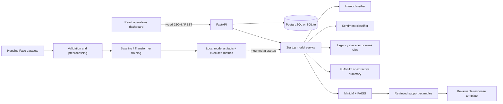

# SupportIQ — AI Customer Support Intelligence Platform

SupportIQ is a full-stack support-operations workspace that turns an incoming customer message into an intent, sentiment, urgency, concise summary, related cases, and a reviewable response draft. It combines reproducible NLP training pipelines with a FastAPI service and a responsive React dashboard.

The application starts without downloaded weights in a clearly marked **demo mode**. Demo predictions use transparent rules and local cosine search; training commands produce versionable artifacts and real evaluation records that the API picks up on its next start. AI drafts are always labeled for human review.

## Why this project

Support teams often triage the same patterns manually while critical conversations compete with routine questions. SupportIQ provides a practical, auditable foundation for routing and agent assistance without sending customer content to a paid external API. It is a portfolio implementation, not a claim that synthetic urgency labels or public benchmark performance are ready for autonomous production decisions.

## Features

- Banking77 intent classification with TF-IDF baselines and optional DistilBERT fine-tuning
- negative / neutral / positive sentiment modeling on TweetEval
- configurable low / medium / high / critical weak-label rules and review CSV export
- extractive development summaries and optional FLAN-T5 fine-tuning on SAMSum
- all-MiniLM-L6-v2 embeddings with cosine FAISS retrieval
- intent- and sentiment-aware response templates grounded by retrieved examples
- ticket creation, history, filters, similar-ticket retrieval, and queue analytics
- real-run-only model metrics; no placeholder evaluation scores
- PostgreSQL in Docker with a SQLite local fallback
- structured logs, request IDs, typed validation, central errors, CORS, and health reporting
- accessible loading, empty, validation, and connection-error states in the dashboard

## Architecture



The API loads artifacts once during its lifespan, not once per request. If artifacts or optional ML packages are absent, the same API contract remains usable and reports the fallback behind every result and at `GET /health`.

## Repository layout

```text
backend/                 FastAPI app, SQLAlchemy models, inference service
frontend/                React + TypeScript + Vite + Tailwind dashboard
ml/                      Shared preprocessing and executable ML scripts
data/                    Tracked demo fixtures; raw/processed outputs ignored
models/                  Local artifacts and metrics (weights ignored)
tests/                   Pytest preprocessing, inference, and API tests
docs/                    Dataset, model, and deployment notes
docker-compose.yml       PostgreSQL, API, and dashboard stack
requirements*.txt        Runtime and optional heavyweight ML dependencies
```

## Datasets and responsible use

The download command resolves configurations, inspects builder features, and fails if expected columns have changed *before* preprocessing. Banking77's legacy Hub loader requires remote code, so SupportIQ deliberately does not execute it; the pipeline uses Hugging Face's built-in CSV loader against the same publisher CSV URLs declared by the official loader, derives the class mapping, and casts it to `ClassLabel`.

| Task | Dataset | Expected fields | License shown by source card | Important limitation |
|---|---|---|---|---|
| Intent | [PolyAI/banking77](https://huggingface.co/datasets/PolyAI/banking77) | `text`, `label` | CC BY 4.0 | English online-banking queries; 77 intents do not represent every support taxonomy. |
| Sentiment | [cardiffnlp/tweet_eval](https://huggingface.co/datasets/cardiffnlp/tweet_eval), `sentiment` config | `text`, `label` | CC BY 3.0 for sentiment; Twitter terms also apply | Tweets differ from support conversations in length, tone, and distribution. |
| Summarization | [knkarthick/samsum](https://huggingface.co/datasets/knkarthick/samsum) | `dialogue`, `summary` | CC BY-NC-ND 4.0 | Non-commercial license and informal chat domain; verify derivative-model use with counsel. |
| Retrieval / response examples | [bitext/Bitext-customer-support-llm-chatbot-training-dataset](https://huggingface.co/datasets/bitext/Bitext-customer-support-llm-chatbot-training-dataset) | `instruction`, `response`, `intent`, `category` | CDLA-Sharing 1.0 | Hybrid synthetic English examples can be templated, biased, or factually inappropriate for a real policy. |

See [docs/DATASETS.md](docs/DATASETS.md) for dataset-specific constraints. Always verify the upstream card and license at the time of use; `download_datasets.py` also records the current metadata license in `data/raw/manifest.json`.

No downloaded dataset, database, model weight, embedding index, or secret is committed. Preprocessing redacts common email and phone patterns, but production deployments need a complete PII/DLP policy.

## ML pipeline

### Intent

`train_intent_baselines.py` creates word uni/bi-gram TF-IDF features, encodes Banking77 labels, and fits Logistic Regression, Multinomial Naive Bayes, and Linear SVM. It evaluates the untouched test split with accuracy, macro precision, macro recall, macro F1, and one confusion matrix per model. The best baseline by macro F1 is saved with its vectorizer and label encoder.

`finetune_intent.py` fine-tunes DistilBERT with deterministic Trainer seeds and the same scalar metrics. Transformer weights live under `models/intent/distilbert/` and are intentionally ignored by Git.

### Sentiment and urgency

`train_sentiment.py` fine-tunes DistilBERT on TweetEval's three-class sentiment configuration. Urgency has no public ground truth in the selected corpora: `train_urgency.py` applies versioned keyword, time-pressure, and sentiment rules, exports `data/processed/urgency_weak_labels.csv`, and trains Logistic Regression and Random Forest against those labels.

> Urgency metrics measure agreement with **weak/synthetic labels**, not human ground truth. A support domain expert should fill `reviewed_label` and approve the taxonomy before any operational use.

### Summary, retrieval, and response drafting

Local demo mode takes the first informative sentences after redaction. `finetune_summarizer.py` optionally fine-tunes `google/flan-t5-small` on SAMSum. `build_faiss_index.py` encodes Bitext instructions with `sentence-transformers/all-MiniLM-L6-v2`, L2-normalizes them, and writes an inner-product FAISS index (cosine similarity). The response system retrieves relevant examples but emits a conservative template rather than copying their answers or invoking a paid API.

## Evaluation results

The following values were produced by executed smoke runs on 22 July 2026 and are stored beneath `models/metrics/`; they are not claimed as full benchmark results. The intent baselines use Banking77 `train[:1500]` / `test[:500]`. The tiny-random Transformer runs validate tokenization, training, evaluation, serialization, and metric integration only—the checkpoints are intentionally untrained test fixtures and their artifacts live in isolated `*-smoke` directories that the API never loads.

| Task | Model | Accuracy | Macro precision | Macro recall | Macro F1 |
|---|---|---:|---:|---:|---:|
| Intent | Logistic Regression | 0.8900 | 0.8271 | 0.8558 | 0.8390 |
| Intent | Multinomial Naive Bayes | 0.8460 | 0.8003 | 0.8135 | 0.7799 |
| Intent | Linear SVM | **0.9120** | **0.8450** | **0.8769** | **0.8593** |
| Intent pipeline | tiny-random DistilBERT smoke | 0.0000 | 0.0000 | 0.0000 | 0.0000 |
| Sentiment pipeline | tiny-random DistilBERT smoke | 0.3925 | 0.1308 | 0.3333 | 0.1879 |

Urgency weak-label smoke results were 0.8974 macro F1 for Logistic Regression and 0.6949 for Random Forest. These measure only agreement with the deterministic synthetic rules and must not be read as real-world urgency quality. The summarization Trainer path was executed with a tiny-random T5 fixture, but no overlap/factuality metric was computed, so none is reported.

Inspect `models/metrics/*.json`, `models/intent/comparison.json`, the confusion matrices, or the dashboard's **Model metrics** screen. Run the full default checkpoints before making any model comparison or deployment decision. See [docs/MODEL_CARD.md](docs/MODEL_CARD.md) for intended use and failure modes.

## Local setup

Prerequisites: Python 3.11, Node.js 20.19+ or 22.12+ (22 recommended), and optionally PostgreSQL 16.

```bash
cp .env.example .env
python -m venv .venv
# Linux/macOS: source .venv/bin/activate
# Windows PowerShell: .venv\Scripts\Activate.ps1
python -m pip install --upgrade pip
python -m pip install -r requirements.txt
cd frontend && npm install && cd ..
```

Run the two development servers:

```bash
# terminal 1
uvicorn backend.app.main:app --reload --port 8000

# terminal 2
cd frontend
npm run dev
```

Open `http://localhost:5173`; API docs are at `http://localhost:8000/docs`. SQLite tables and six demo tickets are created on the first API start. Set `DATABASE_URL` to a SQLAlchemy PostgreSQL URL to use an existing database.

## Docker

```bash
cp .env.example .env
docker compose up --build
```

Dashboard: `http://localhost:5173` · API: `http://localhost:8000` · OpenAPI: `http://localhost:8000/docs`.

The Compose stack waits for PostgreSQL health before starting the API and for API health before starting the dashboard. Model artifacts can be generated on the host and are mounted read-only into the backend container. Production hardening notes are in [docs/DEPLOYMENT.md](docs/DEPLOYMENT.md).

The default backend image stays small and runs the transparent demo path. To serve mounted Transformer and FAISS artifacts, include the optional ML runtime during the backend build:

```bash
docker compose build --build-arg INSTALL_ML=true backend
docker compose up
```

## Training commands

Install the optional ML dependencies first:

```bash
python -m pip install -r requirements-ml.txt
```

Small smoke workflows:

```bash
python -m ml.scripts.download_datasets --inspect-only
python -m ml.scripts.download_datasets --smoke
python -m ml.scripts.preprocess --task all
python -m ml.scripts.train_intent_baselines --smoke
python -m ml.scripts.finetune_intent --smoke --checkpoint hf-internal-testing/tiny-random-distilbert
python -m ml.scripts.train_sentiment --smoke --checkpoint hf-internal-testing/tiny-random-distilbert
python -m ml.scripts.train_urgency --limit 1500
python -m ml.scripts.finetune_summarizer --smoke --checkpoint hf-internal-testing/tiny-random-t5
python -m ml.scripts.build_faiss_index --smoke
python -m ml.scripts.evaluate --smoke
```

For full runs, omit `--smoke` and set an appropriate urgency `--limit`. Transformer training is deliberately separate from application startup and can run on CPU, although a CUDA GPU is strongly recommended. Restart the API after replacing artifacts.

## Testing and quality checks

```bash
pytest
ruff check backend ml tests
ruff format --check backend ml tests

cd frontend
npm run test -- --run
npm run lint
npm run build
```

Tests cover PII-oriented text cleanup, deterministic weak labels, demo prediction behavior, semantic similarity, request validation, analyze-without-save, create/list/get/similar ticket workflows, analytics, health, and empty model metrics.

## API examples

Analyze without persistence:

```bash
curl -X POST http://localhost:8000/api/tickets/analyze \
  -H "Content-Type: application/json" \
  -d '{"text":"My card was charged twice and I need the duplicate refunded urgently."}'
```

Analyze and save:

```bash
curl -X POST http://localhost:8000/api/tickets \
  -H "Content-Type: application/json" \
  -d '{"subject":"Duplicate charge","text":"My card was charged twice.","channel":"chat"}'
```

```bash
curl "http://localhost:8000/api/tickets?urgency=high&sentiment=negative&limit=25"
curl http://localhost:8000/api/analytics/overview
curl http://localhost:8000/api/models/metrics
curl http://localhost:8000/health
```

Full request and response schemas remain authoritative in OpenAPI.

## Screenshots

> Add screenshots after running the local stack. Suggested captures: operations overview, analyzed negative/critical ticket with response draft, filtered ticket history, and executed model comparison.

| Operations overview | Analysis workspace |
|---|---|
| `docs/screenshots/overview.png` | `docs/screenshots/analysis.png` |

## Current constraints and future work

- Replace weak urgency labels with double-annotated, adjudicated domain data and calibration checks.
- Add Alembic migrations, OAuth/OIDC, tenant isolation, RBAC, rate limits, and an immutable audit log.
- Calibrate classifier confidence and add abstention thresholds plus drift and slice monitoring.
- Move semantic search to a tenant-aware managed vector database at larger scale.
- Add policy-grounded retrieval, citation display, safety filters, and agent feedback capture for response drafts.
- Evaluate summarization factuality and PII leakage, not only overlap metrics.
- Add background job processing, model registry/version rollbacks, OpenTelemetry, and CI/CD.
- Add Playwright end-to-end tests and visual-regression screenshots.

## Resume-ready description

> Built SupportIQ, a production-oriented customer-support intelligence platform using PyTorch/Transformers, scikit-learn, MiniLM/FAISS, FastAPI, SQLAlchemy/PostgreSQL, and React/TypeScript. Implemented reproducible intent, sentiment, weak-label urgency, summarization, semantic retrieval, and human-review response workflows; added real-run model analytics, typed REST APIs, Docker orchestration, structured observability, and automated backend/frontend tests.

## License

Project source is provided for portfolio and educational use. Upstream datasets and pretrained models retain their own licenses; SAMSum's non-commercial restriction is especially important. Add a project-level license only after confirming that it matches your intended distribution and all upstream obligations.
